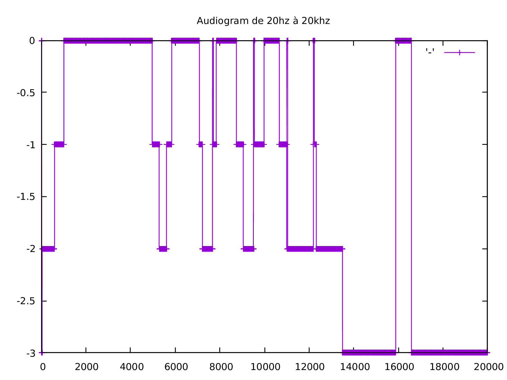

# Audiogram-20to20k 

##  ATTENTION : LE SON EST TRÈS FORT, BAISSEZ-LE AVANT DE LANCER LE CODE.

Le projet est un Audiogram


-   Le projet se réalise sur un Raspberry Pi 4, avec la version du 5 décembre 2023.
-   J'utilise une carte son Audio Injector Stereo (la carte son n'est pas nécessaire ; vous pouvez utiliser celle du Raspberry Pi 4).
-   Un casque ATH-AD900X de chez Audio-Technica.
    Ce code ne prend pas en compte les caractéristiques du casque !
    Attention, votre casque doit pouvoir délivrer un son Hi-res (pouvant aller jusqu'à 44,1 kHz).

## Installation

Le projet est conçu pour fonctionner avec la version d'Ubuntu du 4 décembre 2023.
Pour pouvoir compiler le code, vous devrez installer PortAudio.

   ```sh
  sudo apt-get install portaudio19-dev
  ```

## Notice d'utilisation

Après avoir lancé le code, l'enregistrement se lance, et vous devez rester appuyé sur la touche 1,2 et 3 en fonction du niveau d'écoute que vous entendez, 1 étant une faible diminution du volume et 3 pour une coupure complète du son.

## Demonstration

Voici une démonstration que j'ai faite :



## Export du code
Vous pouvez utiliser ce code comme bon vous semble ; je demanderais juste à être mentionné dans ce cas.
